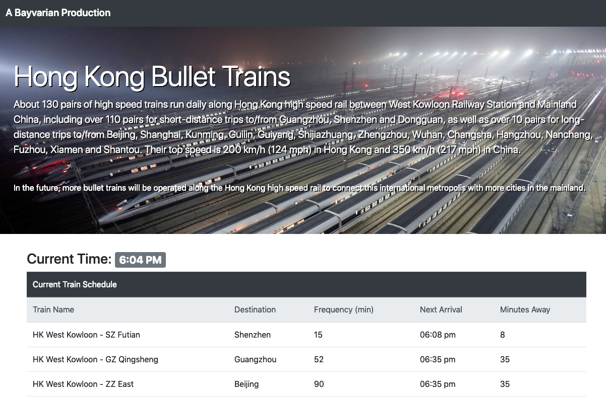

# HW7-Train Scheduler

## Executive Summary
* Short project showcasing use of Firebase real time DB, leveraged combination of popular libraries including jQuery and Bootstrap. 
[Link to Github Repo](https://github.com/bavarianstance/hw7-trainscheduler "Train Scheduler")

## Technologies Used
* HTML
* CSS
* Bootstrap V4+
* reset.css
* Javascript ES6
* jQuery
* Firebase
* Moment.js

### Comments
* ES6 syntax
* Added current timer function
* Standard modules leveraged from bootstrap including Jumbotron, Buttons, Forms, etc.
* Moment.js leveraged to calculate next arrival and minutes away features
* [Link to Github Live Pages](https://bavarianstance.github.io/hw7-trainscheduler/ "Live Deployed")

### Screenshot

